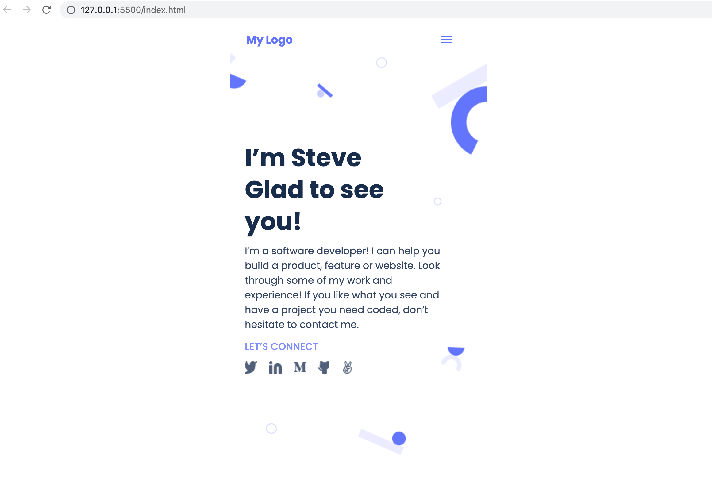

# Microverse-Portfolio

> Hi I'm Steve. Let's create your brand together with World Class client facing Web Apps.

Additional description about the project and its features.

## Built With

- HTML | CSS

## Getting Started

To get a local copy up and running follow these simple example steps.

### Prerequisites
- Text Editor | Git and Github set up

### Setup
- Clone repository and open with text editor

### Usage
- View Portfolio 

## Author

👤 **STEVE W DAMES JR**

- GitHub: [@githubhandle](https://github.com/steveWDamesJr)
- Twitter: [@twitterhandle](https://twitter.com/Steve88312331)
- LinkedIn: [LinkedIn](https://www.linkedin.com/in/steve-w-dames-jr/)

## 🤝 Contributing

Contributions, issues, and feature requests are welcome!

Feel free to check the [issues page](../../issues/).

## Show your support

Give a ⭐️ if you like this project!

## Acknowledgments

- Hat tip to anyone whose code was used
- Inspiration
- etc

## 📝 License

This project is [MIT](./MIT.md) licensed.
